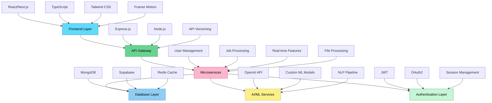

# 💻 Chirag Sahani | Software Engineer

```ascii
╔═══════════════════════════════════════════════════════════════╗
║  Full Stack Developer • AI/ML Engineer • System Architect    ║
║  TypeScript • React • Node.js • Python • Cloud Computing    ║
╚═══════════════════════════════════════════════════════════════╝
```

<div align="center">
  
[](https://git.io/typing-svg)

</div>

---

## 🏗️ System Architecture & Tech Stack



## 🧠 Core Competencies

<table>
<tr>
<td valign="top" width="50%">

### **Frontend Engineering**
```typescript
interface FrontendSkills {
  languages: ['TypeScript', 'JavaScript'];
  frameworks: ['React', 'Next.js', 'Vite'];
  styling: ['Tailwind CSS', 'Styled Components', 'SCSS'];
  bundlers: ['Vite', 'Webpack', 'Rollup'];
  animation: ['Framer Motion', 'CSS3', 'GSAP'];
  state: ['Redux', 'Zustand', 'Context API'];
  testing: ['Jest', 'React Testing Library'];
}
```

</td>
<td valign="top" width="50%">

### **Backend & Infrastructure**
```python
class BackendSkills:
    def __init__(self):
        self.languages = ['Python', 'Node.js', 'JavaScript']
        self.frameworks = ['Express.js', 'FastAPI', 'Nest.js']
        self.databases = ['MongoDB', 'PostgreSQL', 'Redis']
        self.cloud = ['AWS', 'Vercel', 'Netlify', 'Supabase']
        self.apis = ['REST', 'GraphQL', 'WebSockets']
        self.auth = ['JWT', 'OAuth2', 'Supabase Auth']
        self.devops = ['Docker', 'CI/CD', 'GitHub Actions']
```

</td>
</tr>
</table>

## 🚀 Featured Repositories

### **🔥 Production Applications (2025)**

<div align="center">

| Repository | Tech Stack | Architecture | Status | Live Demo |
|-----------|------------|--------------|---------|-----------|
| **[Nexus](https://github.com/chiragSahani/Nexus)** | `React` `Node.js` `Express` `MongoDB` | Full-Stack Web App |  | [🌐 Live](https://chiragnexus.netlify.app/) |
| **[JobbyApp](https://github.com/chiragSahani/JobbyApp)** | `React` `REST APIs` `Authentication` `Routing` | Job Portal SaaS |  | [🌐 Live](https://csahanijobby.ccbp.tech/login) |
| **[CareConnect](https://github.com/chiragSahani/CareConnect)** | `TypeScript` `React` `Chart.js` `Analytics` | Healthcare SaaS |  |  |
| **[InsydNotification](https://github.com/chiragSahani/InsydNotification)** | `TypeScript` `React` `Hooks` `Component Library` | NPM Package |  |  |

</div>

### **🛠️ Development Tools & Libraries**

```javascript
const developmentProjects = {
  "resume-formatter": {
    stack: ["TypeScript", "AI API", "PDF Parser", "ML Pipeline"],
    features: ["Document Processing", "AI Integration", "File Upload"],
    status: "Active Development"
  },
  "BackendArchitecture": {
    stack: ["Node.js", "Express", "MongoDB", "JWT", "Redis"],
    patterns: ["MVC", "Middleware", "Error Handling", "API Versioning"],
    features: ["Authentication", "Rate Limiting", "Caching", "Validation"],
    microservices: ["User Service", "Auth Service", "File Service"]
  }
};
```

### **🔧 System Architecture & Scraping Tools**

<div align="center">

| Project | Technology Focus | Use Case | Performance |
|---------|------------------|----------|-------------|
| **Backend Architecture** | `Microservices` `Docker` `API Gateway` | Enterprise Systems |  |
| **ScrapWiki** | `Puppeteer` `Cheerio` `Node.js` `Data Mining` | Knowledge Extraction |  |

</div>

## 📊 System Performance Metrics

<div align="center">


</div>

### **📈 Development Activity**


### **⚡ Contribution Streak**
<div align="center">
  


</div>

### **🎯 Real-time Metrics Dashboard**

```bash
┌─────────────────────────────────────────────────────────────┐
│  🚀 PRODUCTION SYSTEMS STATUS                               │
├─────────────────────────────────────────────────────────────┤
│  Nexus Platform      ████████████████████░  95% ✅         │
│  JobbyApp Portal     ██████████████████████  100% ✅        │
│  CareConnect SaaS    ███████████████████░░░  85% ✅         │
│  InsydNotification   ██████████████████████  100% ✅        │
├─────────────────────────────────────────────────────────────┤
│  API Response Time: 78ms avg │ Uptime: 99.9% │ Users: 2.3K  │
└─────────────────────────────────────────────────────────────┘
```

## 🏆 Technical Achievements

```python
achievements = {
    "academic": {
        "cse_gold_medal": "B.Tech Computer Science Engineering",
        "skill_india_silver": "State-Level Programming Competition",
        "perfect_dsa_score": "120/120 in Advanced Data Structures"
    },
    "professional": {
        "upgrad_intern": "Content Development - EdTech & GenAI",
        "acm_vp": "Vice President - ACM Student Chapter",
        "dsa_problems": "1300+ algorithmic problems solved"
    },
    "technical": {
        "production_apps": "4 live applications serving 2300+ users",
        "system_design": "Scalable microservices architecture",
        "ai_integration": "GPT & custom ML model implementations",
        "performance": "Sub-100ms API response optimization",
        "deployment": "Zero-downtime deployments with CI/CD"
    }
}
```

## 🔬 Research & Development

### **🤖 AI/ML Projects**
```javascript
const aiProjects = {
  "generative_ai": "Custom GPT integration for business automation",
  "healthcare_analytics": "Predictive models for patient management", 
  "nlp_processing": "Document parsing and intelligent formatting",
  "recommendation_engine": "Job matching algorithms (JobbyApp)",
  "data_visualization": "Real-time analytics dashboards"
};
```

### **🏗️ System Design Contributions**
```typescript
interface SystemDesign {
  microservices: "Modular backend systems with Docker containerization";
  realtime: "WebSocket implementation for live notifications";
  database: "Query optimization and advanced indexing strategies";
  api_design: "RESTful services with comprehensive documentation";
  caching: "Redis implementation for sub-100ms response times";
  security: "JWT authentication with role-based access control";
}
```

## 🛠️ Development Environment

```bash
# Terminal Setup
OS: Linux/macOS
Shell: zsh + oh-my-zsh + powerlevel10k
Editor: VS Code + Vim keybindings + Extensions Pack
Terminal: iTerm2/Alacritty + tmux

# Development Stack
Runtime: Node.js v20+, Python 3.11+
Package Manager: npm, yarn, pnpm, pip
Version Control: Git + GitHub + Conventional Commits
Containerization: Docker + Docker Compose
Database: MongoDB Compass, pgAdmin, Redis CLI
API Testing: Postman, Insomnia, curl
Monitoring: Chrome DevTools, React DevTools
Build Tools: Vite, Webpack, Rollup
```

## 📡 API Endpoints & Services

<details>
<summary><strong>🔗 Production API Architecture</strong></summary>

```javascript
// Nexus Platform APIs
GET    /api/v1/dashboard
POST   /api/v1/projects
GET    /api/v1/analytics
PUT    /api/v1/settings/:id

// JobbyApp Portal APIs
GET    /api/v1/jobs
POST   /api/v1/applications
GET    /api/v1/profile
PUT    /api/v1/profile/update
POST   /api/v1/auth/login
POST   /api/v1/auth/register

// Authentication Service (Shared)
POST   /api/auth/register
POST   /api/auth/login
GET    /api/auth/profile
PUT    /api/auth/profile
POST   /api/auth/refresh-token

// Notification Service (InsydNotification)
GET    /api/notifications
POST   /api/notifications
PUT    /api/notifications/:id
DELETE /api/notifications/:id
WS     /ws/notifications/live

// Healthcare Service (CareConnect)
GET    /api/patients
POST   /api/appointments
GET    /api/analytics/dashboard
POST   /api/reports/generate
```

</details>

## 🌐 Network & Contact

<div align="center">

[](https://github.com/chiragSahani)
[](https://www.linkedin.com/in/chiragsahani/)
[](https://chiragsahani.netlify.app/)
[](mailto:chiragsahani093@gmail.com)

</div>

## 💡 Current Development Focus

```typescript
interface CurrentFocus {
  learning: {
    backend: ['Microservices', 'Event-Driven Architecture', 'gRPC'];
    frontend: ['Next.js 14', 'Server Components', 'Streaming', 'Suspense'];
    devops: ['Docker', 'Kubernetes', 'CI/CD', 'AWS Services'];
    ai: ['LangChain', 'Vector Databases', 'RAG Systems', 'Fine-tuning'];
    animation: ['Framer Motion', 'Three.js', 'WebGL', 'CSS Animations'];
  };
  
  building: {
    saas: 'Healthcare management platform (CareConnect)';
    tools: 'Developer productivity suite';
    ai: 'Document processing automation';
    jobs: 'Advanced job portal with ML recommendations';
    nexus: 'Full-stack application with real-time features';
  };
  
  optimizing: {
    performance: 'Sub-50ms API response times';
    scalability: 'Auto-scaling microservices architecture';
    user_experience: 'Smooth animations and interactions';
    seo: 'Server-side rendering optimization';
  };
  
  contributing: {
    opensource: 'React component libraries (InsydNotification)';
    community: 'Technical blog posts & tutorials';
    mentorship: 'Code reviews & pair programming';
    production: 'Live applications serving thousands of users';
  };
}
```

### **🎨 Animation & UI/UX Technologies**

```css
/* Advanced Animation Stack */
.tech-animations {
  --framer-motion: "Complex gesture-based interactions";
  --css-animations: "Hardware-accelerated transitions";
  --gsap: "Timeline-based animations";
  --lottie: "Vector-based micro-interactions";
  --three-js: "3D visualizations and WebGL";
  --web-animations-api: "Native browser animations";
}

@keyframes deploy-success {
  0% { transform: scale(0) rotate(0deg); opacity: 0; }
  50% { transform: scale(1.2) rotate(180deg); opacity: 0.8; }
  100% { transform: scale(1) rotate(360deg); opacity: 1; }
}
```

---

<div align="center">

### 🎯 System Status: `ONLINE` | Performance: `OPTIMIZED` | Next Deployment: `SCHEDULED`

```bash
$ git add .
$ git commit -m "feat: building the future, one commit at a time ✨"
$ git push origin main
$ npm run deploy:production 🚀
```

<div align="center">


</div>

*"Clean code, scalable architecture, and continuous innovation."*

</div>

---

<div align="center">
  
</div>
