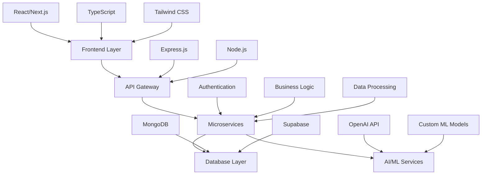

# 💻 Chirag Sahani | Software Engineer

```ascii
╔═══════════════════════════════════════════════════════════════╗
║  Full Stack Developer • AI/ML Engineer • System Architect    ║
║  TypeScript • React • Node.js • Python • Cloud Computing    ║
╚═══════════════════════════════════════════════════════════════╝
```

<div align="center">
  
[](https://git.io/typing-svg)

</div>

---

## 🏗️ System Architecture & Tech Stack



## 🧠 Core Competencies

<table>
<tr>
<td valign="top" width="50%">

### **Frontend Engineering**
```typescript
interface FrontendSkills {
  languages: ['TypeScript', 'JavaScript'];
  frameworks: ['React', 'Next.js'];
  styling: ['Tailwind CSS', 'Styled Components'];
  bundlers: ['Vite', 'Webpack'];
  animation: ['Framer Motion', 'CSS3'];
  state: ['Redux', 'Zustand', 'Context API'];
}
```

</td>
<td valign="top" width="50%">

### **Backend & Infrastructure**
```python
class BackendSkills:
    def __init__(self):
        self.languages = ['Python', 'Node.js']
        self.frameworks = ['Express.js', 'FastAPI']
        self.databases = ['MongoDB', 'PostgreSQL']
        self.cloud = ['AWS', 'Vercel', 'Supabase']
        self.apis = ['REST', 'GraphQL', 'WebSockets']
        self.auth = ['JWT', 'OAuth2', 'Supabase Auth']
```

</td>
</tr>
</table>

## 🚀 Featured Repositories

### **🔥 Latest Releases (2025)**

<div align="center">

| Repository | Tech Stack | Architecture | Status |
|-----------|------------|--------------|---------|
| **[InsydNotification](https://github.com/chiragSahani/InsydNotification)** | `TypeScript` `React` `Hooks` | Component Library |  |
| **[resume-formatter](https://github.com/chiragSahani/resume-formatter)** | `TypeScript` `AI API` `PDF Parser` | ML Pipeline |  |
| **[CareConnect](https://github.com/chiragSahani/CareConnect)** | `TypeScript` `React` `Chart.js` `Analytics` | Healthcare SaaS |  |
| **[employee-directory](https://github.com/chiragSahani/employee-directory)** | `React` `Vite` `Tailwind` `REST API` | Enterprise App |  |

</div>

### **🔧 Core Infrastructure Projects**

```javascript
const coreProjects = {
  "BackendArchitecture": {
    stack: ["Node.js", "Express", "MongoDB", "JWT"],
    patterns: ["MVC", "Middleware", "Error Handling", "API Versioning"],
    features: ["Authentication", "Rate Limiting", "Logging", "Validation"]
  },
  "ScrapWiki": {
    stack: ["JavaScript", "Puppeteer", "Cheerio", "Node.js"],
    patterns: ["Web Scraping", "Data Pipeline", "Async Processing"],
    use_case: "Knowledge Extraction & Data Mining"
  }
};
```

## 📊 System Performance Metrics

<div align="center">


</div>

### **📈 Development Activity**


### **⚡ Contribution Streak**
<div align="center">
  


</div>

## 🏆 Technical Achievements

```python
achievements = {
    "academic": {
        "cse_gold_medal": "B.Tech Computer Science Engineering",
        "skill_india_silver": "State-Level Programming Competition",
        "perfect_dsa_score": "120/120 in Advanced Data Structures"
    },
    "professional": {
        "upgrad_intern": "Content Development - EdTech & GenAI",
        "acm_vp": "Vice President - ACM Student Chapter",
        "dsa_problems": "1300+ algorithmic problems solved"
    },
    "technical": {
        "system_design": "Scalable microservices architecture",
        "ai_integration": "GPT & custom ML model implementations",
        "performance": "Sub-100ms API response optimization"
    }
}
```

## 🔬 Research & Development

### **AI/ML Projects**
- **Generative AI Pipeline**: Custom GPT integration for business automation
- **Healthcare Analytics**: Predictive models for patient management
- **NLP Processing**: Document parsing and intelligent formatting systems
- **Web Scraping Engine**: Distributed data extraction architecture

### **System Design Contributions**
- **Microservices Architecture**: Modular backend systems with Docker
- **Real-time Systems**: WebSocket implementation for live notifications
- **Database Optimization**: Query optimization and indexing strategies
- **API Design**: RESTful services with comprehensive documentation

## 🛠️ Development Environment

```bash
# Terminal Setup
OS: Linux/macOS
Shell: zsh + oh-my-zsh
Editor: VS Code + Vim keybindings
Terminal: iTerm2/Alacritty

# Development Stack
Runtime: Node.js v18+, Python 3.9+
Package Manager: npm, yarn, pip
Version Control: Git + GitHub
Containerization: Docker
Database: MongoDB Compass, pgAdmin
API Testing: Postman, curl
Monitoring: Chrome DevTools, Network Tab
```

## 📡 API Endpoints & Services

<details>
<summary><strong>🔗 Sample REST API Architecture</strong></summary>

```javascript
// Authentication Service
POST   /api/auth/register
POST   /api/auth/login
GET    /api/auth/profile
PUT    /api/auth/profile

// Notification Service (InsydNotification)
GET    /api/notifications
POST   /api/notifications
PUT    /api/notifications/:id
DELETE /api/notifications/:id

// Healthcare Service (CareConnect)
GET    /api/patients
POST   /api/appointments
GET    /api/analytics/dashboard
```

</details>

## 🌐 Network & Contact

<div align="center">

[](https://github.com/chiragSahani)
[](https://www.linkedin.com/in/chiragsahani/)
[](https://chiragsahani.netlify.app/)
[](mailto:chiragsahani2002@gmail.com)

</div>

## 💡 Current Development Focus

```typescript
interface CurrentFocus {
  learning: {
    backend: ['Microservices', 'Event-Driven Architecture'];
    frontend: ['Next.js 14', 'Server Components', 'Streaming'];
    devops: ['Docker', 'CI/CD', 'AWS Services'];
    ai: ['LangChain', 'Vector Databases', 'RAG Systems'];
  };
  
  building: {
    saas: 'Healthcare management platform';
    tools: 'Developer productivity suite';
    ai: 'Document processing automation';
  };
  
  contributing: {
    opensource: 'React component libraries';
    community: 'Technical blog posts & tutorials';
    mentorship: 'Code reviews & pair programming';
  };
}
```

---

<div align="center">

### 🎯 System Status: `ONLINE` | Performance: `OPTIMIZED` | Next Deployment: `SCHEDULED`

```bash
$ git commit -m "feat: building the future, one commit at a time"
$ git push origin main
```

*"Clean code, scalable architecture, and continuous learning."*

</div>

---

<div align="center">
  
</div>
