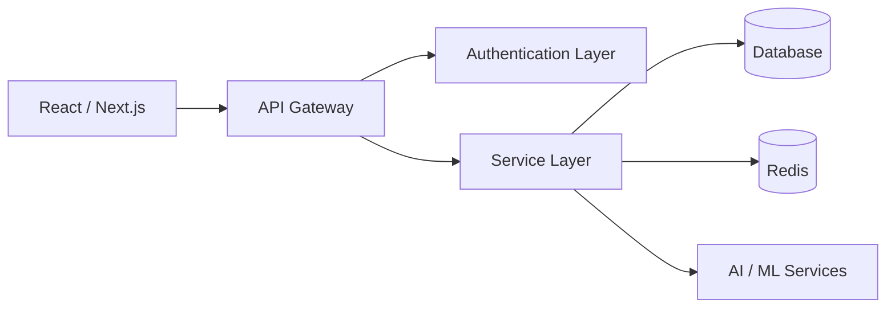

<!-- ======================= PREMIUM HEADER ======================= -->

<p align="center">
  
</p>

<p align="center">
  <b>Backend Systems Engineer · Scalable Architecture · AI Platforms</b>
</p>

<p align="center">
  
  
  
  
</p>

---

# Engineering Profile

```ts
const engineer = {
  specialization: "High-performance backend systems",
  architecture: "Modular · Multi-tenant · Secure",
  focus: ["System Design", "RBAC", "Analytics Pipelines", "AI Integration"],
  philosophy: "Build systems that scale predictably."
};
```

---

# Architecture Approach



### Core Engineering Patterns

- Controller → Service → Data separation  
- Multi-tenant organization-scoped design  
- JWT + Role-Based Access Control  
- Indexed queries & aggregation pipelines  
- Versioned REST APIs  
- Centralized error handling  

---

# Enterprise LMS Platform

Production-grade, multi-tenant Learning Management System.

**Capabilities**

- Organization-level isolation  
- Invitation-based onboarding  
- Course distribution & enrollment engine  
- Session lifecycle management  
- Progress analytics dashboard  

**Engineering**

- Optimized MongoDB schema design  
- Aggregation-based analytics queries  
- Role-aware middleware validation  
- Secure onboarding & user provisioning  

Designed for scalability, clarity, and long-term extensibility.

---

# Production Systems

**Nexus**  
Modular full-stack platform with versioned REST APIs and optimized DB indexing.

**JobbyApp**  
Secure SaaS platform with protected routing and authentication control.

**CareConnect**  
Healthcare analytics dashboard with performance-optimized data rendering.

**InsydNotification**  
Reusable TypeScript-based notification component system.

---

# Engineering Metrics

<p align="center">
  
  
</p>

---

# Technical Strength

### Backend
- REST API Design  
- Multi-tenant Architecture  
- RBAC & Secure Authentication  
- Aggregation & Analytics Queries  
- Middleware Pipelines  
- Database Indexing  

### AI Systems
- GPT API integrations  
- NLP workflows  
- Intelligent automation pipelines  

### DevOps
- Docker  
- CI/CD  
- Cloud deployments  

---

# Achievements

- Gold Medal – Computer Science Engineering  
- State-Level Silver Medal – Skill India  
- 1300+ Algorithmic Problems Solved  
- Multiple live production systems  

---

<p align="center">
  <b>Clean architecture. Measurable performance. Scalable systems.</b>
</p>

<p align="center">
  
</p>
