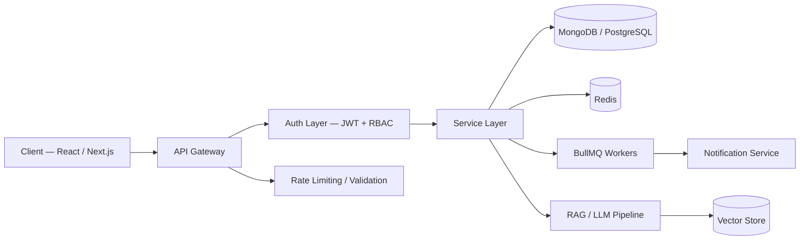

<div align="center">


<a href="https://www.linkedin.com/in/chiragsahani"></a>
<a href="https://chiragsahani.netlify.app"></a>
<a href="https://github.com/chiragSahani"></a>

</div>

<br/>

## Overview

```yaml
role:            AI Software Engineer, Trao Technologies (remote)
focus:           Backend systems, multi-tenant architecture, AI/RAG platforms
education:       B.Tech CSE, Chandigarh Group of Colleges — Gold Medalist, GPA 8.7
current_build:   Melior — AI proposal automation platform
problem_solving: 1,300+ DSA problems, multiple top-100 national rankings
location:        Haldwani, Uttarakhand, India
```

I design and ship backend systems for multi-tenant SaaS products — API layers, authorization models, and data pipelines that need to hold up under real traffic, not just demo well. Most of my recent work sits at the intersection of conventional backend engineering (REST APIs, RBAC, queues, indexing) and applied AI (RAG pipelines, document ingestion, LLM-backed automation).

---

## System Design

Representative request path for the multi-tenant platforms I build:


```mermaid
flowchart LR
    Client[Client — React / Next.js] --> Gateway[API Gateway]
    Gateway --> Auth[Auth Layer — JWT + RBAC]
    Gateway --> Rate[Rate Limiting / Validation]
    Auth --> Service[Service Layer]
    Service --> DB[(MongoDB / PostgreSQL)]
    Service --> Cache[(Redis)]
    Service --> Queue[BullMQ Workers]
    Service --> AI[RAG / LLM Pipeline]
    AI --> Vector[(Vector Store)]
    Queue --> Notify[Notification Service]
```

**Patterns applied consistently across projects**

| Concern | Approach |
|---|---|
| Layering | Controller → Service → Repository, no business logic in route handlers |
| Tenancy | Organization-scoped data access enforced at the service layer, not just the query |
| AuthZ | JWT sessions + role-based middleware, permission checks colocated with the resource |
| Performance | Compound/indexed queries, aggregation pipelines over in-memory filtering |
| Async work | Redis-backed BullMQ queues for anything that shouldn't block the request cycle |
| API surface | Versioned REST endpoints, consistent error envelope, centralized error handling |
| AI integration | Document ingestion → chunking → vector storage → retrieval-augmented generation |

---

## Selected Work

**Melior — AI Proposal Automation** · *Trao Technologies*
Platform that automates proposal generation for client-facing teams — document ingestion, AI-assisted drafting, and pricing/portal access workflows, with the internal onboarding and comms tooling built around it.

**Enterprise LMS Platform**
Multi-tenant learning management system with organization-level data isolation, invitation-based onboarding, course/enrollment engines, session lifecycle management, and an aggregation-driven analytics dashboard on MongoDB.

**Nexus**
Modular full-stack platform built around versioned REST APIs and indexing strategy tuned for read-heavy access patterns.

**JobbyApp**
SaaS platform with protected routing and session-based authentication control.

**CareConnect**
Healthcare analytics dashboard, optimized for rendering large result sets without blocking the UI thread.

**InsydNotification**
Reusable, typed notification component system built for reuse across multiple frontends.

---

## Stack

<p>


</p>

| Layer | Tools |
|---|---|
| Backend | Node.js, Express, REST API design, middleware pipelines |
| Data | MongoDB (schema design, aggregation pipelines), PostgreSQL, Redis |
| Async / Jobs | BullMQ, Redis-backed queues |
| Auth | JWT, RBAC, session management |
| AI / ML | OpenAI-compatible LLM APIs, RAG pipelines, document ingestion, vector storage, NLP workflows |
| Infra | Docker, NGINX, PM2, CI/CD, DigitalOcean, Vercel |
| Frontend | React, Next.js, TypeScript |

---

## Metrics

<div align="center">


</div>

> Stats run on **GitHub Stats Extended** (`github-stats-extended.vercel.app`), the actively maintained successor to the original `github-readme-stats` project (which has been paused), plus `streak-stats.demolab.com`, the maintainer's own stable hosted domain rather than a generic Vercel deploy. This avoids the token/rate-limit failures a self-hosted fork hits. If a card is briefly unreachable, it's almost always a transient GitHub API rate limit on the shared instance, not a config error on your end.

---

## Strengths

<table>
<tr>
<td valign="top" width="33%">

**Backend**
- REST API design
- Multi-tenant architecture
- RBAC & session-based auth
- Aggregation & analytics queries
- Middleware pipelines
- Database indexing strategy

</td>
<td valign="top" width="33%">

**AI Systems**
- LLM API integration
- RAG pipeline design
- Document ingestion & chunking
- Vector storage
- NLP-driven automation

</td>
<td valign="top" width="33%">

**Infra / DevOps**
- Docker
- CI/CD pipelines
- NGINX, PM2 process management
- Cloud deployment (DigitalOcean, Vercel)

</td>
</tr>
</table>

---

## Recognition

- Gold Medalist, B.Tech Computer Science Engineering — GPA 8.7
- State-Level Silver Medal, Skill India
- 1,300+ algorithmic problems solved across competitive programming platforms
- Multiple top-100 national rankings

---

<div align="center">

<a href="https://www.linkedin.com/in/chiragsahani"></a>
<a href="https://github.com/chiragSahani"></a>
<a href="https://chiragsahani.netlify.app"></a>

<sub>Clean architecture. Measurable performance. Systems that scale predictably.</sub>


</div>
